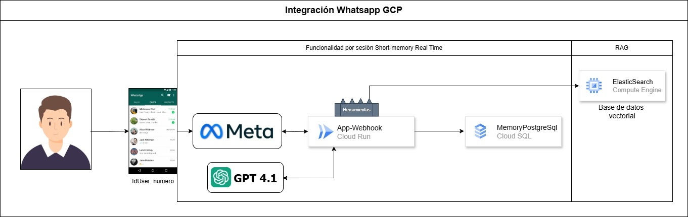

# 🤖 Agente de WhatsApp con LangChain + GPT-4.1

Este repositorio contiene una implementación completa de un agente conversacional desplegable en **Google Cloud Run**, capaz de interactuar con usuarios a través de **WhatsApp**, utilizando **GPT-4.1**, memoria persistente con **PostgreSQL**, recuperación de contexto con **ElasticSearch** y un flujo conversacional basado en el patrón **ReAct** de LangChain.

---

## 📂 Estructura del Proyecto

```
.
├── code/
│   ├── app.py               # Lógica del agente y servidor Flask
│   ├── Dockerfile           # Imagen Docker para Cloud Run
│   ├── requirements.txt     # Dependencias del entorno
├── Notebook Agent whatsapp.ipynb  # Notebook explicativo del agente
├── old_version_2024/        # Primera versión con cadenas LangChain y memoria en Cloud Storage
```

---

## 🧠 Descripción del Agente

El agente está diseñado para asistir en ventas de computadoras y productos tecnológicos, guiando al usuario por un flujo natural de conversación:

1. Saludo y exploración de necesidades.
2. Consulta de productos (usando recuperación semántica desde ElasticSearch).
3. Opciones de entrega (tienda o domicilio).
4. Confirmación del pedido.
5. Método de pago.
6. Cierre de la compra con instrucciones de pago o código de recogida.

El modelo utilizado es `gpt-4.1-2025-04-14`, integrado en un agente ReAct (`create_react_agent`) de LangChain, que usa herramientas y memoria por sesión vía `thread_id`.

---

## 🗺️ Arquitectura



1. **Usuario** interactúa desde su aplicacion de whatsapp.
2. **Meta** Mediante el API nativa de Meta captura el mensaje.  
3. **Cloud Run** recibe `/webhook?` por POST y activa LangChain.  
4. El **agente** consulta → Elasticsearch (conocimiento) + PostgreSQL (memoria).  
5. GPT‑4.1 genera la respuesta; LangSmith traza cada paso.  
6. La respuesta JSON la formatea y retorna a whatsapp.

---

## 🔧 Tecnologías Utilizadas

- **LangChain**: Orquestador del agente y herramientas.
- **GPT-4.1**: Modelo base para generar respuestas.
- **LangGraph**: Framework de flujos de agente y memoria persistente.
- **PostgreSQL**: Almacenamiento de memoria por sesión (`PostgresSaver`).
- **ElasticSearch**: Base de datos vectorial para recuperación de productos.
- **Flask**: API que sirve de webhook para WhatsApp.
- **Docker**: Contenedor listo para despliegue en Google Cloud Run.

---

## 🚀 Despliegue en Cloud Run

1. Clonar el repositorio:

   ```bash
   git clone https://github.com/tu_usuario/whatsapp-agent
   cd whatsapp-agent/code
   ```

2. Construir y subir la imagen:

   ```bash
   gcloud builds submit --tag gcr.io/tu-proyecto/whatsapp-agent
   ```

3. Desplegar en Cloud Run:

   ```bash
   gcloud run deploy whatsapp-agent \
     --image gcr.io/tu-proyecto/whatsapp-agent \
     --platform managed \
     --region us-central1 \
     --allow-unauthenticated \
     --port 8080
   ```

---

## 📩 Conexión con WhatsApp

Este proyecto está preparado para funcionar con la **API oficial de WhatsApp Business** (Meta):

- El endpoint `/webhook` recibe los mensajes entrantes (GET para validación, POST para eventos).
- Responde automáticamente usando el agente configurado y envía respuestas al número correspondiente.
- Requiere un `token` y `webhook_url` que se configuran en el código (usa variables de entorno en producción).

---

## 🔐 Variables de Entorno (sugeridas)

Para producción, reemplaza los valores sensibles en `app.py` por variables de entorno:

```bash
OPENAI_API_KEY=
WHATSAPP_TOKEN=
WHATSAPP_URL=
POSTGRES_URL=
ELASTIC_PASSWORD=
TOKENMETA=
```

---

## 📓 Notebook de Explicación

En la raíz encontrarás el notebook `Notebook Agent whatsapp.ipynb` con una explicación paso a paso del funcionamiento del agente, ideal para comprender la lógica detrás del flujo y probar localmente.

---

## 🧪 Requisitos

Archivo `requirements.txt` con todas las dependencias necesarias:

```txt
Flask==2.0.1
gunicorn==20.1.0
psycopg[binary,pool]==3.2.6
werkzeug==2.0.3
langchain-openai
langchain_core
langgraph
langgraph-checkpoint-postgres
langchain
langchain-community
elasticsearch
langchain-elasticsearch
```

---


## 🌍 Comunidad y Contribuciones


Este proyecto es de **código abierto** y nació con el propósito de compartir, aprender y construir en comunidad.  
Si tienes ideas, mejoras o simplemente quieres sumarte, ¡las contribuciones están más que bienvenidas! 🙌

[](https://github.com/macespinoza/BotWhatsappGPT/stargazers)
[](https://github.com/macespinoza/BotWhatsappGPT/fork)

> Puedes abrir un Pull Request o crear un Issue si quieres proponer mejoras o reportar errores.  

---

## 🤝 Conecta conmigo

Gracias por revisar este repositorio.  
Si te interesa colaborar, aprender más o invitarme a dar una charla, puedes escribirme o seguirme en LinkedIn:

[](https://www.linkedin.com/in/mcotrina/)

> IA & Data con propósito
